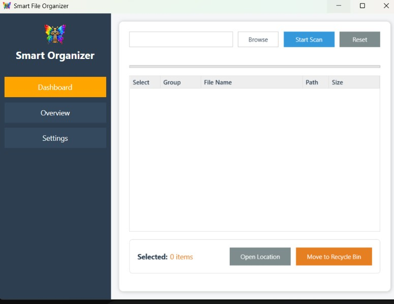
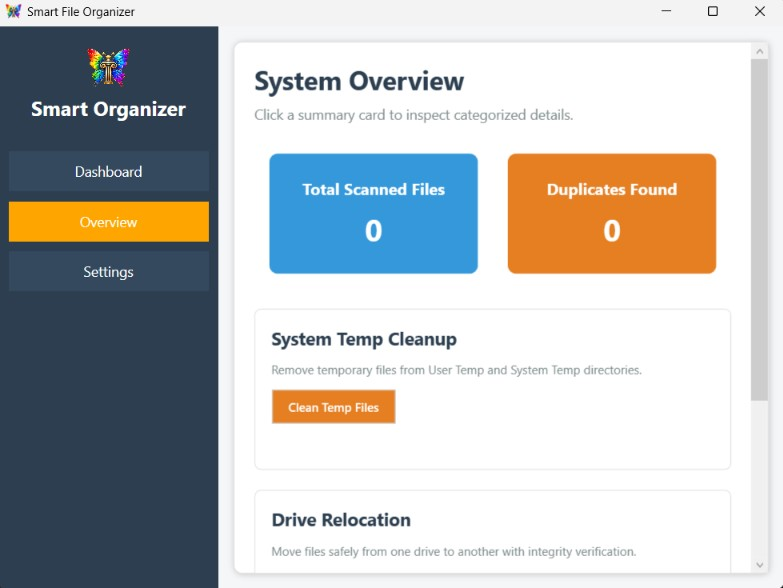
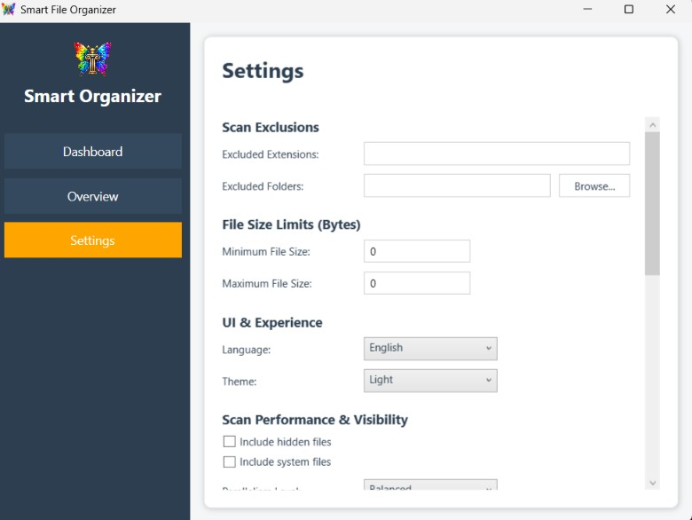

# SmartFileOrganizer

A high-performance Windows desktop application designed for advanced duplicate file detection and image similarity analysis.

## Features
- **Two-Pass File Hashing:** Efficiently scans and compares large datasets to identify exact byte-for-byte duplicate files.
- **Image Similarity Detection:** Utilizes advanced comparison algorithms to detect visually similar images, not just identical files.
- **Optimized UI:** Built with WPF to handle heavy I/O operations without blocking the main interface.

## Technology Stack
- **Language:** C#
- **Framework:** .NET 8
- **UI:** WPF ( Windows Presentation Foundation )
- **Packaging:** Inno Setup / MSIX

## Development Journey & AI Integration
This project serves as a foundational step into desktop software engineering. The development process heavily utilized AI-assisted workflows [ Antigravity desktop environment, Ollama local models ] to accelerate learning, structure the application architecture, and troubleshoot complex system-level errors.

**Key Technical Challenges Resolved:**
1. **Repository & Build Management:** Overcoming GitHub's 100MB file size limits by correctly configuring `.gitignore` for `.NET` compiled outputs ( bin / obj ) and restructuring the commit history to maintain a clean repository.
2. **Packaging & Deployment:** Managing the transition from raw compiled binaries to professional installers using Inno Setup and MSIX packaging for Microsoft Store compatibility.
3. **Algorithmic Efficiency:** Implementing a two-pass hashing mechanism to prevent excessive memory consumption when analyzing large volumes of files.

## Usage
1. Launch the application.
2. Click 'Browse' to select a folder to scan.
3. Click 'Start Scan' to find duplicates.
4. Review the detected duplicates and select files to remove.
5. Click 'Delete Selected' to clean up your space.
