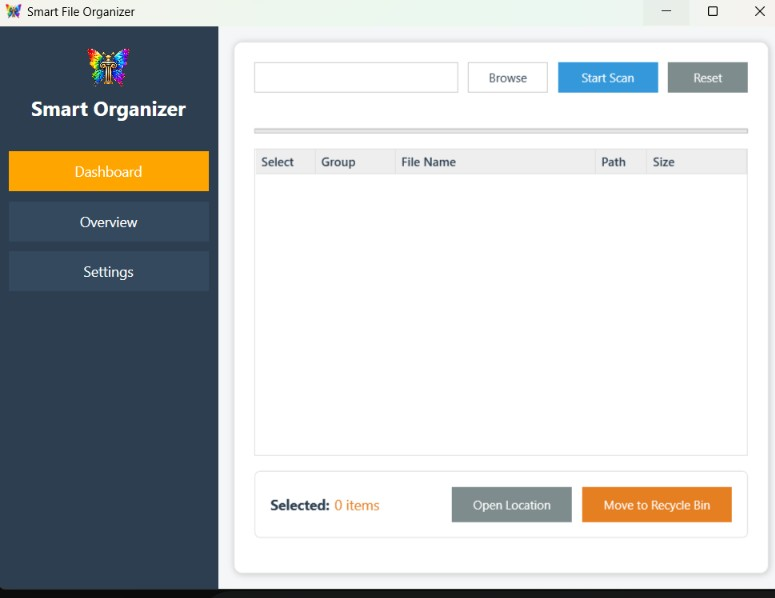
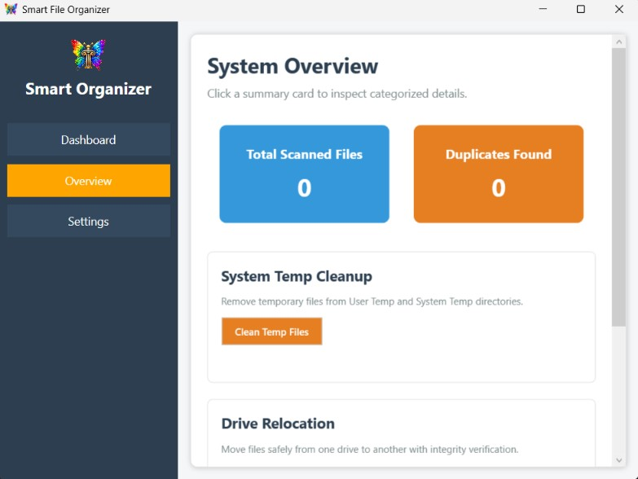
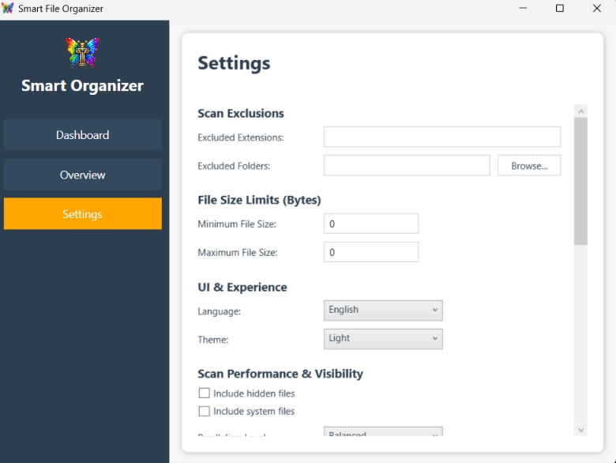

# Smart File Organizer

   

Smart File Organizer is a robust desktop application designed to discover, analyze, and safely clean up duplicate and similar files across your drives without the risk of accidental data loss.

## 📸 Screenshots

### Splash Screen

### Dashboard

### Overview

### Settings

## ✨ Features
- **Duplicate Detection**: Accurately finds identical files using fast, parallel hash calculations.
- **Visual Similarity Engine**: Detects visually similar images using SkiaSharp, helping you clean up photo libraries.
- **Safe Delete & History**: Operations are tracked in an SQLite history database, utilizing Windows Recycle Bin to prevent permanent accidental deletion.
- **Temp Cleanup**: Dedicated service to quickly safely clear out system and user temporary folders.
- **Drive Relocation**: Safely move bulk files between drives with verification.
- **Multi-language Support**: Full support for localization, including RTL (Right-to-Left) interfaces like Arabic.

## 🖥️ System Requirements
- **OS**: Windows 10 or Windows 11 (x64)
- **Runtime**: .NET 8 Desktop Runtime
- **Minimum RAM**: 4 GB
- **Disk space**: 250 MB for installation (plus space for the SQLite caching database in `%LOCALAPPDATA%`)

## 📥 Installation
1. Download the latest `SmartFileOrganizer_Setup_v1.0.1.exe` installer from the Releases page.
2. Run the installer and follow the setup wizard.
3. Launch the application from your Start Menu or Desktop shortcut.

*(Note: The application can also be run portably by directly downloading the single-file executable).*

## 🚀 Usage
1. **Dashboard**: View your total space saved and recent operations at a glance.
2. **Scan**: Select a target folder or drive and initiate a scan. The system will securely hash files in the background without freezing the UI.
3. **Review**: The application presents groups of duplicates and visually similar files.
4. **Clean**: Choose the items you want to remove. Select which duplicates to remove — the original file is always preserved by default until you explicitly choose otherwise.

## 🗑️ Safe Delete
Smart File Organizer operates on the principle of `Safety > Aggressive Cleanup`.
- **Recycle Bin Integration**: Deleting files routes them to the Windows Recycle Bin by default. No permanent deletion occurs without explicit overriding.
- **Drive Safety Guard**: Critical OS paths (`C:\Windows`, `Program Files`, etc.) are actively blocked from all scanning and modification operations.

## 🏗️ Architecture
The application strictly enforces a Clean Architecture structure:
- **Core**: Contains domain models (`FileRecord`, `DuplicateGroup`), enums, and pure interfaces.
- **Application**: Contains the business logic, orchestrators, and use-case handlers.
- **Infrastructure**: Handles the external dependencies (SQLite Entity Framework, SkiaSharp image processing, Windows File System APIs).
- **UI**: A Windows Presentation Foundation (WPF) application implementing MVVM, strictly communicating downwards.

## 🛠️ Tech Stack
- **.NET 8.0**
- **WPF (Windows Presentation Foundation)**
- **Microsoft.Extensions.DependencyInjection (v7.0.0)** for robust DI container support.
- **Microsoft.EntityFrameworkCore.Sqlite (v7.0.15)** for local caching and history.
- **SkiaSharp** for high-performance, license-free image decoding and similarity checks.

## 📋 Changelog
For a detailed list of all new features, bug fixes, and security updates, please see the [CHANGELOG.md](CHANGELOG.md) file.
## 🤝 Contributing
Contributions, issues and feature requests are welcome!
Feel free to check the [issues page](https://github.com/youssifyg/SmartFileOrganizer/issues).

## ⭐ Show Your Support
If this project helped you, please give it a ⭐ on GitHub!

**GitHub:** https://github.com/youssifyg/SmartFileOrganizer

## 📄 License
This project is licensed under the [MIT License](LICENSE).
